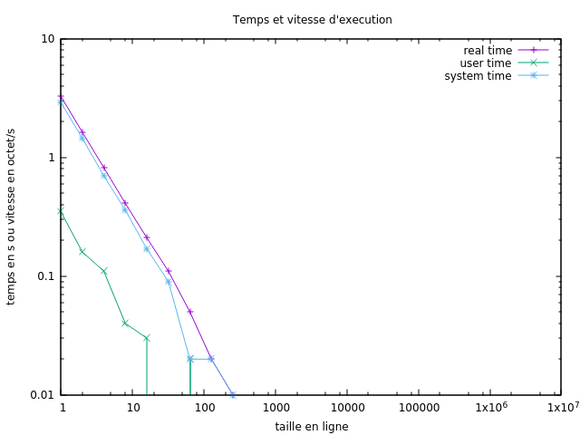

#   Performances des entrées/sorties

Vienne Jérémy
Irakoze Franco

exécution des test via "make test";

Question 3:
  On sait que le nombre d'appels a la fonction write() va dépendre de la taille du buffer.
  C'est à dire que plus la taille du buffer est grande plus le nombre d'appels à la fonction write() sera minime.
  En effet avant d'écrire on va attendre que le buffer soit rempli.

  Donc on peut constater via les tests et le grahique que plus taille du buffer MCAT_BUFSIZ augmente plus le temps (real time, system time, user time) de lecture diminue.

